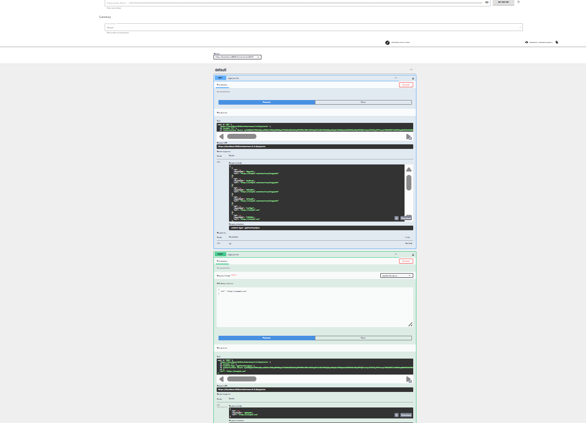
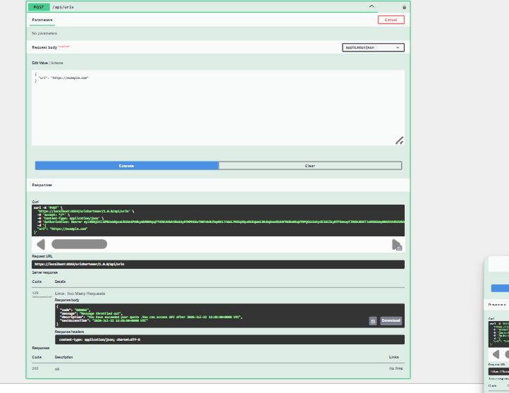
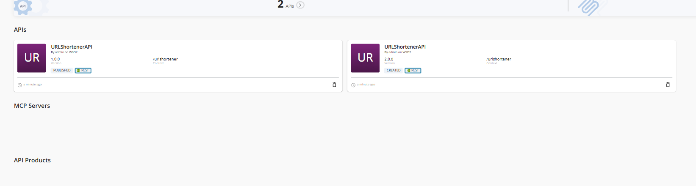
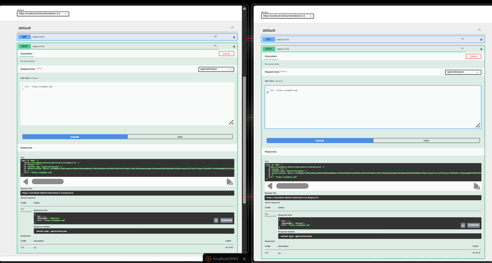
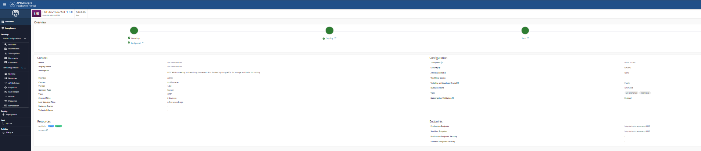

# URL Shortener API

[](https://github.com/1Ferwiz/url-shortener/actions/workflows/ci.yml)

A simple REST API for shortening URLs, built with Spring Boot. Demonstrates database persistence, caching, validation, and layered project organization following SOLID principles.

## Tech Stack

- Java 21
- Spring Boot 4
- PostgreSQL (persistent storage)
- Redis (caching — Cache-Aside pattern)
- Maven
- Lombok
- Docker / Docker Compose

## Architecture

The project follows a standard layered architecture:
controller/   → REST endpoints (HTTP layer)
service/      → Business logic (interface + implementation)
repository/   → Spring Data JPA data access
entity/       → JPA entities
dto/          → Request/response objects
exception/    → Custom exceptions + global exception handler
config/       → Configuration (Redis setup)
util/         → Helper classes (short code generator)

Key design decisions:
- **DTO pattern** — API contracts are fully decoupled from database entities.
- **Dependency Inversion** — Controller depends on the `UrlService` interface, not its implementation.
- **Repository pattern** — Spring Data JPA abstracts all database access.
- **Cache-Aside pattern** — Redis is checked first on reads; Postgres is only queried on a cache miss, then the result is written back to Redis.
- **Centralized exception handling** — `@RestControllerAdvice` converts exceptions into consistent, structured HTTP error responses.

## Prerequisites

- Java 21 (JDK)
- Docker Desktop (or Docker Engine + Compose)
- IntelliJ IDEA (or any IDE) — Maven is used via the bundled wrapper (`mvnw`), no separate Maven install required

## Running the project

1. **Start PostgreSQL and Redis:**
```bash
   docker compose up -d
```
This starts:
- PostgreSQL on `localhost:5433` (mapped from container port 5432)
- Redis on `localhost:6379`

2. **Run the application** (via IntelliJ's Run button, or):
```bash
   ./mvnw spring-boot:run
```
The API will be available at `http://localhost:8080`.


## CI/CD

Every push and pull request to `main` triggers a GitHub Actions pipeline (`.github/workflows/ci.yml`) that:

1. Spins up ephemeral PostgreSQL and Redis containers
2. Runs the full test suite against them
3. Builds a Docker image from the multi-stage `Dockerfile`
4. On `main` only: pushes the image to GitHub Container Registry (GHCR), tagged with both the commit SHA and `latest`

This confirms the application builds, passes its tests, and produces a working container image on a clean environment for every change — proving it's deployable, even though this project isn't hosted anywhere yet.

## API Endpoints

### Create a short URL
POST /api/urls
Content-Type: application/json
{
"url": "https://example.com/some/very/long/path"
}
**Response — `201 Created`**
```json
{
  "id": 1,
  "shortCode": "abc123",
  "url": "https://example.com/some/very/long/path"
}
```

### Retrieve the original URL
GET /api/urls/{shortCode}
**Response — `200 OK`**
```json
{
  "id": 1,
  "shortCode": "abc123",
  "url": "https://example.com/some/very/long/path"
}
```
Returns `404 Not Found` if the short code doesn't exist. Checks Redis first; falls back to PostgreSQL on a cache miss and repopulates Redis (24-hour TTL).

### List all URLs
GET /api/urls
**Response — `200 OK`** — array of all stored URLs.

## Validation

`POST /api/urls` validates that `url` is present and a syntactically valid URL. Invalid input returns `400 Bad Request` with details on which field(s) failed.

- **No URL deduplication** — each `POST /api/urls` call always creates a new short code, even for a previously-shortened URL. This is intentional: distinct short codes for the same destination allow independent tracking/expiry per link, rather than treating identical URLs as the same resource.

## WSO2 API Manager Integration

On top of the core Spring Boot API, this project is fronted by **WSO2 API Manager 4.7.0** as a real API Gateway/Management layer, running as a Docker container alongside the app, PostgreSQL, and Redis — all on one shared Docker network via `docker-compose.yml`.

This was completed as a structured, task-by-task exercise. Each task below was performed against this actual API (not a demo/sample API), deployed and verified end-to-end through the WSO2 Developer Portal.

### Architecture note

The Spring Boot app is reachable from WSO2 within the Docker network as `http://url-shortener-app:8080` (service name, not `localhost`) — this is how WSO2's endpoint config is set up, since containers on the same Docker network address each other by service name.

### 1. Create the API

Created `URLShortenerAPI` in the Publisher, context `/urlshortener`, version `1.0.0`, backed by the Spring Boot app's `GET /api/urls` endpoint. Deployed and published, then verified end-to-end via the Developer Portal's API Console: generated a real OAuth2 test token, executed the request, and got a genuine `200 OK` with real data from PostgreSQL — proving the full chain (browser → WSO2 Gateway → Docker network → app container → PostgreSQL).



### 2. Add a new resource

Added `POST /api/urls` as a second resource on the same API. This required going beyond the Resources tab's simple HTTP-verb-and-path UI: WSO2 doesn't auto-generate a request body schema for a manually-added resource, so the OpenAPI/Swagger definition (Publisher → API Definition) had to be hand-edited to add a `requestBody` schema matching the existing `CreateUrlRequest` DTO (`{"url": "..."}`). After that, it was deployed, published, and confirmed working end-to-end via the Developer Portal.

### 3. Secure the API (OAuth2)

Every WSO2 API is secured with OAuth2 by default — verified in practice throughout this whole process, since every request through the gateway required a valid OAuth2 access token (generated via "GET TEST KEY" against a subscribed Application's Consumer Key/Secret pair). Requests without a valid token are rejected before ever reaching the backend.

### 4. Apply rate limiting

The default throttling tiers available (`10KPerMin`, `20KPerMin`, `50KPerMin`, `Unlimited`) were all too large to meaningfully demonstrate, so a custom **Advanced Throttling Policy** (`5PerMin` — 5 requests per minute) was created via the Admin Portal (`/admin` → Rate Limiting Policies → Advanced Throttling) and applied specifically to the `POST /api/urls` operation, while `GET /api/urls` was left `Unlimited`.

Hammering `POST /api/urls` past the limit produced a real `429 Too Many Requests`, with a response body confirming the throttle and a `nextAccessTime` for when the limit resets:



### 5. Create multiple API versions

Created a second version, `2.0.0`, as a full copy of `1.0.0` (same resources, security, and rate limiting config), deployed and published independently. Both versions run live simultaneously, each on its own gateway path:

- `1.0.0`: `https://localhost:8243/urlshortener/1.0.0`
- `2.0.0`: `https://localhost:8243/urlshortener/2.0.0`



Verified independence by calling `POST /api/urls` on both versions side-by-side — each returned its own distinct short code from the same underlying database, proving both versions are genuinely live and independently callable:



### 6. Modify API metadata

Added a description and tags (`url-shortener`, `internship`) to the API's Basic Info / Design Configurations screen in the Publisher, so the API is properly documented for anyone browsing it in the Developer Portal.



### 7. Explore the Developer Portal

Used extensively throughout the above tasks: browsing the API catalog, managing Applications (including generating/regenerating OAuth2 Consumer Key/Secret pairs), subscribing an Application to the API, and using the interactive API Console (Try Out) to execute real authenticated requests against both API versions.

### Local access

| Portal | URL |
|---|---|
| Publisher | `https://localhost:9443/publisher` |
| Developer Portal | `https://localhost:9443/devportal` |
| Admin Portal | `https://localhost:9443/admin` |
| Gateway (v1.0.0) | `https://localhost:8243/urlshortener/1.0.0` |
| Gateway (v2.0.0) | `https://localhost:8243/urlshortener/2.0.0` |

Default credentials for all portals (local dev only): `admin` / `admin`. The browser will show a self-signed certificate warning — this is expected for a local WSO2 instance.

### API definition export

The full OpenAPI/Swagger definition exported from WSO2 (including the hand-added `POST` request body schema, security scheme, and gateway endpoint config) is committed at [`screenshots/wso2-api-definition.json`](screenshots/wso2-api-definition.json).

### Remaining tasks (not yet done)

- Import and Export an API (via `apictl` CLI)
- Add API Documentation (within WSO2, distinct from this README)
- Explore API Analytics and Logs
- 